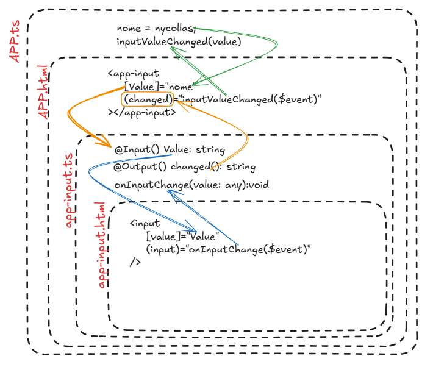

## [ ] - Input
- Será Variável
- Vem de um nível acima
- Pai para filho
```
@Input()
label: string = "";
```

## ( ) - Output
- Grandes chances de ser um Event
- Sai para o nível acima
- Filho pro pai
```
@Output()
Change: EventEmitter<string>= new EventEmitter();
```


# Form